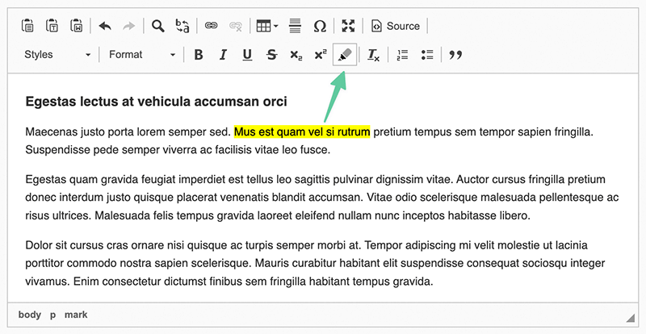

# HTML &lt;mark&gt; Tag for CKEditor 4


**A CKEditor plugin to wrap text with an HTML &lt;mark&gt; Tag**



## ✏️ What will it do?

This plugin will add a new button with the possibility to wrap text with an `<mark>` HTML tag.

**Included translations:**<br>
🇬🇧 🇺🇸 English<br>
🇩🇪 German

## 🚀 Quickstart

1. Download the latest 🔖 [Release](https://github.com/peter-neumann-dev/markTag/releases)
2. Include the plugin to your CKEditor setup `[path to your CKEditor]/plugins/`
3. Add markTag to external plugins:

```javascript
config.extraPlugins = 'markTag';
```

<br>

---

[](https://peter-neumann.dev/)
